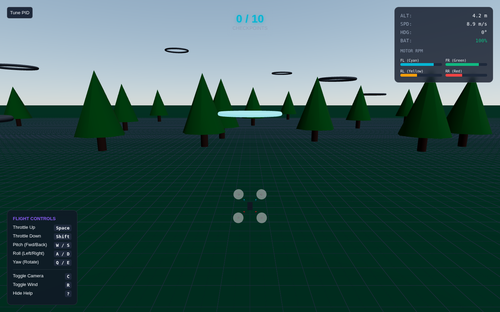
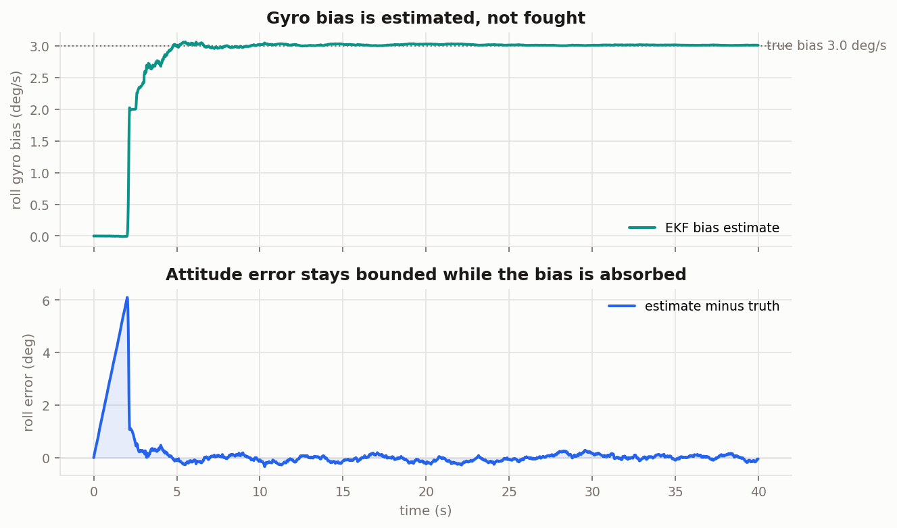
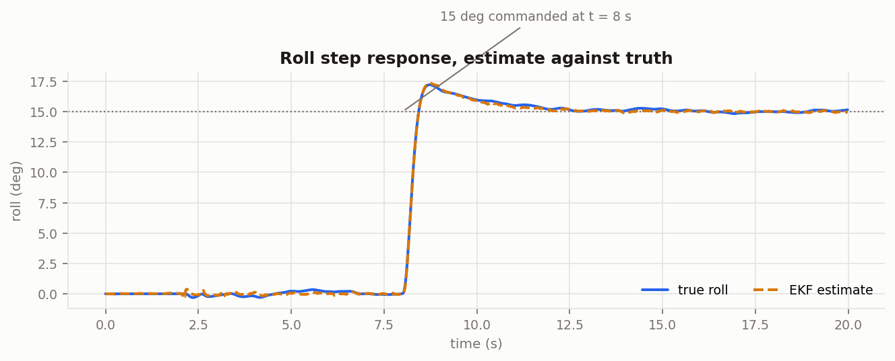
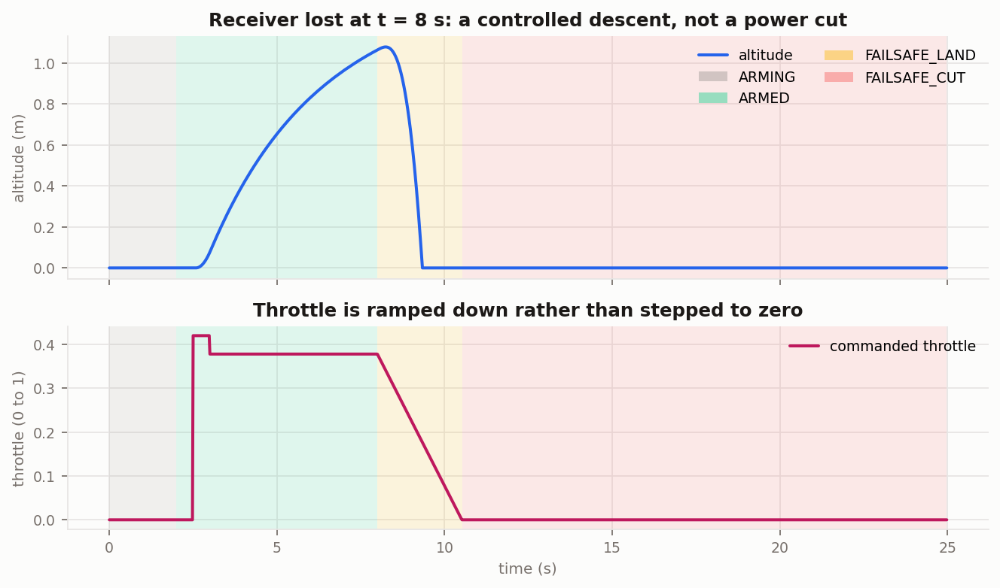
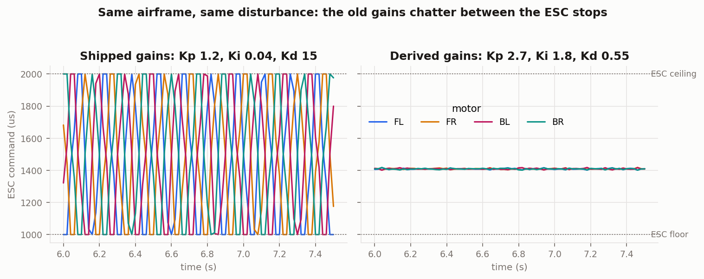
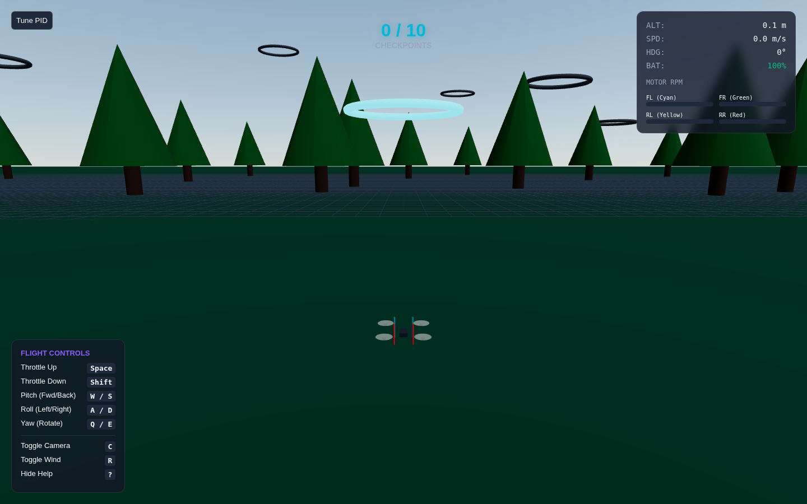

<div align="center">

# 🚁 DroneCtrl

**Quadcopter Flight Controller with PID Stabilization, Sensor Fusion & Interactive 3D Simulator.**

[](https://opensource.org/licenses/MIT)
[](#)
[](#)
[](#)

</div>



DroneCtrl is an open-source flight control system that bridges the gap between hardware engineering and software simulation. It provides a robust C++ firmware for ESP32/Arduino-based quadcopters, featuring real-time PID stabilization and sensor fusion. Alongside the firmware, it includes an interactive 3D web simulator to test algorithms and tune parameters safely before real-world flight.

## Overview

DroneCtrl is a complete quadcopter flight control system designed for learning and experimentation. It combines real ESP32/Arduino firmware with an interactive 3D web simulator, allowing you to understand drone stabilization without needing physical hardware.

The system implements industry-standard techniques: an extended Kalman filter for attitude estimation with online gyro bias correction, PID control loops for attitude stabilization, and a motor mixer that preserves control authority under saturation.

The control, estimation and safety code carries no Arduino dependency, so the same source the flight controller runs is linked by the host unit tests and flown by the software-in-the-loop harness. That is what makes the claims below checkable rather than asserted: every number in [Verification](docs/verification.md) is produced by `make run`.

---

## ✨ Key Features

- 🧠 **Real ESP32/Arduino firmware** for quadcopter control
- 🎯 **4-state extended Kalman filter** for attitude, with online gyro bias estimation and adaptive accelerometer rejection
- ⚖️ **PID stabilization** (pitch, roll, yaw) with gains derived from a plant model, not guessed
- 🔀 **Saturation-aware motor mixer** that sacrifices throttle rather than attitude authority
- 🛡️ **Latching failsafe state machine** with a documented land-versus-cut policy per fault
- 🧪 **52 host unit tests** on the exact flight headers, no board and no dependencies
- ✈️ **Software-in-the-loop harness** flying 9 scenarios with injected faults
- 🔌 **CAN telemetry frame encoding** with transfer counting and gap detection
- 📈 **Flight log output and analysis plots**
- 🗺️ **GPS waypoint navigation**
- 🤖 **Waypoint autopilot** with cascaded guidance, velocity and attitude loops
- 🎮 **Interactive 3D web simulator** (Three.js)
- 📊 **Telemetry dashboard** with real-time gauges and an artificial horizon
- 🎛️ **Configurable PID tuning interface** with live controller output
- ⏱️ **Fixed-timestep physics**, so flight behaviour does not change with frame rate

## 🏗️ Architecture

```text
Sensors (IMU/GPS/Baro) → Sensor Fusion → PID Controller → Motor Mixer → ESC → Motors
                                           ↑
                                  Setpoint from RC/Waypoints
```

In AUTO the setpoint comes from the autopilot rather than the sticks, through the
same three nested loops a production flight stack uses:

```text
waypoint  →  position error   →  velocity setpoint      (guidance, ~ once per step)
             velocity error   →  acceleration command   (velocity loop)
             acceleration cmd →  roll / pitch / thrust  (attitude mapping)
                              →  attitude PID → motor mixer
```

Only the outer two loops are autopilot-specific. The attitude loop is the same
PID stack a pilot flies through by hand, so both modes share one controller and
the tuning panel affects both.

## 🛠️ Tech Stack

| Layer | Technology |
| :--- | :--- |
| **Firmware** | C++, Arduino, ESP32, PlatformIO |
| **Sensors** | MPU6050 (IMU), BMP280 (Barometer), GPS |
| **Estimation** | Extended Kalman filter, gyro bias estimation, innovation monitoring |
| **Control** | Cascaded PID, saturation-aware motor mixing, failsafe state machine |
| **Verification** | Host unit tests, software-in-the-loop, fault injection, GitHub Actions |
| **Simulator & HUD** | TypeScript, React, Three.js (@react-three/fiber, @react-three/drei), WebGL |

## ⚙️ How It Works

### Flight Controller Loop
A fixed 250 Hz loop, in four steps: read the IMU and step the estimator, feed the estimate and the receiver into the flight state machine, run the attitude PIDs if and only if that machine allows it, then mix to four ESC outputs. `main.cpp` is wiring and nothing else, because logic that lands there is logic that cannot be tested without a board and a flight.

### State Estimation
A four-state extended Kalman filter estimates roll, pitch and the gyro's two horizontal bias terms. The accelerometer is used as an observation of the gravity vector rather than pre-converted into angles, and `R` is inflated in proportion to how far the measured magnitude departs from 1 g, so a manoeuvring airframe de-weights the update instead of reading its own acceleration as tilt.

The interesting comparison is not the static one. With a clean accelerometer, the complementary filter this replaced settles only about 0.4 degrees off under a 2 deg/s gyro bias, and the tests say so rather than overstating the case. The difference appears when the accelerometer stops being usable: over ten seconds of gyro-only propagation the old filter walks off by about 20 degrees, while the EKF, carrying bias as a state, stays inside 3.



Full derivation, tuning and the two sign errors that used to cancel each other: [docs/state_estimation.md](docs/state_estimation.md).

### PID Stabilization
Three PIDs, with derivative on measurement, a derivative low-pass expressed as a time constant so its cutoff does not move with the loop rate, and an integrator that is held whenever the mixer reports it could not deliver last step's torque.

The gains are derived from the plant rather than guessed. For the modelled airframe one microsecond of roll command produces about 13.3 deg/s² of angular acceleration, which sets `omega_n^2 = 13.3 Kp` and `2 zeta omega_n = 13.3 Kd + 1.8`; solving for 6 rad/s and a damping ratio of 0.75 gives the values in `config.h`.



### Motor Mixing
X configuration. The naive mix clamps each motor independently, and that clamp is where attitude authority quietly goes missing: once a motor hits the ceiling the extra command is discarded, the four outputs no longer differ by the torque the controller asked for, and the airframe stops responding in roll exactly at the high throttle where it is least forgiving.

This mixer treats the differential torques as the thing worth protecting and the common throttle as the thing that can give way. It computes the widest throttle window that keeps every motor in range, moves the requested throttle into it, and only scales the torques themselves if they cannot fit at any throttle, equally on all axes so the commanded direction survives even when its magnitude cannot. Sacrificing altitude to hold attitude is nearly always right, because a quadcopter that has lost attitude control cannot recover altitude either.

### Failsafes
A latching state machine with an explicit policy per fault, rather than an implicit one in the order of a few if statements:

| Fault | Response | Why |
| :--- | :--- | :--- |
| Signal loss | controlled descent | still controllable and still knows its attitude |
| Low battery | controlled descent | known in advance; the remaining charge is for this |
| Excessive tilt | cut power | past this angle the controller cannot recover it |
| Estimator diverged | cut power | attitude unknown, so every command is a guess |

Failsafes latch. A receiver that recovers mid-descent does not silently hand control back, because that is how an airframe ends up climbing again while someone walks towards it.



## 🧪 Verification

```bash
cd firmware/test && make run     # 52 unit tests, ~2 s, no dependencies
cd firmware/sil  && make run     # 9 SIL scenarios with fault injection, ~3 s
cd firmware      && pio run      # both target builds
```

The control, estimation and safety headers carry no Arduino dependency, so the tests and the simulator link the same source the flight controller runs. A control law verified in a separate implementation has only been verified as a separate implementation.

**The harness rejected the gains this project shipped with.** Mean attitude looked fine, which is what makes the failure mode easy to miss; the actuators told the real story.



| | Before | After |
| :--- | :--- | :--- |
| Hover ESC range | 1000 to 2000 us | 1398 to 1419 us |
| Steady flight on an ESC rail | continuous | 0 of 2796 samples |
| Roll RMS in hover | unstable | 0.11 deg |
| Roll step, 15 deg commanded | not tracked | 15.0 deg, 15% overshoot, 0.38 s to 90% |
| One motor at 70% thrust | past 45 deg in 6 s | peak 0.7 deg |

The old gains are kept as a scenario that **passes by failing**, so if they are ever reintroduced and the harness stops objecting, CI turns red.

What the SIL model does not contain: blade flapping, ground effect, propeller inflow, battery sag under load, ESC nonlinearity, structural flex. It is good enough to catch a sign error, an unstable gain, a windup bug or a failsafe that does not fire. It is not good enough to predict flight time, and the gains above are tuned for the simulated airframe, not a substitute for bench tuning on real hardware.

Hardware in the loop is not built yet. The seam for it is in place, and saying what is missing seems more useful than implying it is there.

Details, including the defect the unit tests found on their first run: [docs/verification.md](docs/verification.md).

## 🚀 Getting Started

### Prerequisites
- Node.js (v16+)
- PlatformIO IDE

### Hardware Setup
1. Connect the ESP32 to the MPU6050 IMU via I2C.
2. Wire the 4 ESC signal lines to the designated ESP32 PWM pins.
3. Ensure proper power distribution and grounding.

### Firmware Flash
1. Open the project in PlatformIO.
2. Connect your ESP32 via USB.
3. Build and upload the firmware.

### Simulator
To run the local 3D web simulator and telemetry dashboard:
```bash
cd simulator
npm install
npm run dev
```

The control law has a headless test that flies the full circuit with no browser
and no renderer, and fails if the autopilot cannot complete laps, drifts off
heading, or behaves differently at a different timestep:
```bash
cd simulator
npm run check
```

## 📂 Project Structure

```text
DroneCtrl/
├── firmware/          # ESP32 and Arduino C++ flight controller
│   ├── include/       # Estimator, control law, mixer, state machine, drivers
│   ├── src/           # main.cpp, which is wiring and nothing else
│   ├── test/          # Host unit tests, plain g++, no dependencies
│   ├── sil/           # Software-in-the-loop harness and flight logs
│   └── platformio.ini # Build configuration, plus a host environment
├── simulator/         # Three.js 3D web simulator + React telemetry HUD
│   ├── src/engine/    # Physics, PID controller, autopilot (no React, no renderer)
│   ├── src/components/# Scene and HUD
│   └── tools/         # Headless flight check
├── tools/             # Flight log plotting
└── docs/              # Architecture, state estimation, verification, wiring
```

## 🎛️ PID Tuning Guide

The gains in `config.h` are derived from the airframe model in `firmware/sil`, not tuned by hand. If your airframe differs, redo the derivation in [docs/verification.md](docs/verification.md) with your own mass, arm length and motor thrust, then check the result with `cd firmware/sil && make run` before flying it.

If you would rather tune empirically:
1. **P (Proportional)**: Increase until the drone oscillates rapidly, then reduce by 20 to 30%. This provides the immediate corrective force.
2. **D (Derivative)**: Increase to dampen the P-term oscillations and soften the response to rapid changes. Too much D causes jitter, and past a point it stops being jitter and becomes the actuators chattering between their stops while mean attitude still looks acceptable. Watch the motor outputs, not just the attitude.
3. **I (Integral)**: Increase slowly to hold attitude against external forces such as wind or an off-centre CG.

## 🕹️ Simulator Controls

| Action | Control |
| :--- | :--- |
| **Throttle Up/Down** | `Space` / `Shift` |
| **Pitch Forward/Back** | `W` / `S` |
| **Roll Left/Right** | `A` / `D` |
| **Yaw Left/Right** | `Q` / `E` |
| **Toggle autopilot** | `M` |
| **Cycle camera** (chase / cinematic / FPV / top-down) | `C` |
| **Toggle wind** | `R` |
| **PID tuning panel** | `P` |
| **Toggle telemetry** | `T` |
| **Hide help** | `H` |

The simulator starts in **AUTO** and flies the circuit on its own. Touching any
flight control hands you the aircraft, exactly as a ground station drops out of
mission mode on manual input.

## 🗺️ Roadmap

- [x] Basic stabilization
- [x] 3D simulator
- [x] GPS waypoints
- [x] Waypoint autopilot in the simulator
- [x] Extended Kalman filter with gyro bias estimation
- [x] Host unit tests and software-in-the-loop with fault injection
- [ ] Hardware in the loop: the same control loop on the board, sensors injected over serial
- [ ] Magnetometer, which is what would make a yaw state observable
- [ ] Optical flow integration
- [ ] Return to home (RTH) failsafe
- [ ] FPV camera feed streaming

## 📸 Screenshots

### Autopilot on final approach to a gate


### Cinematic camera


The HUD shows live altitude, ground and vertical speed, heading, battery and
per-motor RPM, plus an artificial horizon. While the autopilot is engaged it
also reports its current phase, target gate, range and altitude error.

### Live Demo
**[drone-ctrl.vercel.app](https://drone-ctrl.vercel.app)** runs in the browser,
no install. It starts on autopilot, so you can watch it fly a lap before taking
over.

To run it locally instead:
```bash
cd simulator
npm install
npm run dev
```

## 🤝 Contributing
Contributions are welcome! Please feel free to submit a Pull Request. Make sure to read [CONTRIBUTING.md](CONTRIBUTING.md) before getting started.

## 📜 License
This project is licensed under the MIT License - see the LICENSE file for details.

## 🙏 Acknowledgments
- Inspired by MultiWii and Betaflight.
- Three.js community for excellent WebGL resources.
