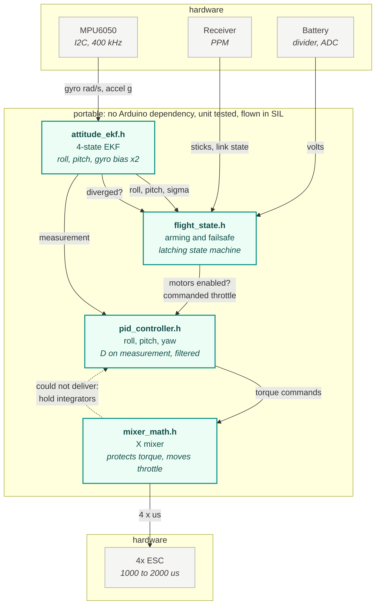
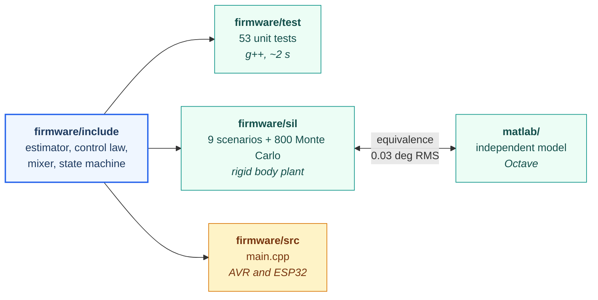

# Architecture

One 250 Hz loop, four steps, and a deliberate line drawn through the middle of
it. Everything above that line is arithmetic and state with no Arduino
dependency; everything below it touches hardware. That line is what the whole
verification story rests on, so it is the thing this page is really about.

## The control loop

Two details in that picture are easy to miss and both are deliberate.

**The state machine sits between the estimator and the controller, not beside
them.** The PIDs never see the pilot's throttle directly; they see whatever
the state machine decided the throttle should be. That is what lets a failsafe
descent be an ordinary control step rather than a special case threaded
through the control law.

**The mixer talks back.** When it cannot deliver the torque it was asked for,
it says so, and the PIDs freeze their integrators for that step. Without that
edge, a brief saturation becomes an overshoot after it clears, because the
integrator spent the saturation winding up against a limit it could not see.

## The line through the middle

`attitude_ekf.h`, `flight_state.h`, `pid_controller.h`, `mixer_math.h` and
`can_telemetry.h` include no Arduino header. That is not tidiness. It is what
allows three different harnesses to attach to the same source:

The tests and the simulator compile **the same file the aircraft runs**, not a
copy of it. A control law verified in a separate implementation has only been
verified as a separate implementation, and the two always drift apart; when
they do, the simulator keeps passing while the aircraft does something else.

The MATLAB model is the deliberate exception. It **is** a second
implementation, written to be readable where the firmware is written to fit in
2 kB of RAM, and `matlab/verify_mil_sil.m` exists precisely because a second
implementation is only worth having if something checks it against the first.

## Module by module

| File | Responsibility | Arduino? |
| :--- | :--- | :---: |
| `attitude_ekf.h` | roll, pitch and gyro bias from IMU data | no |
| `flight_state.h` | arming gesture, failsafe policy, commanded throttle | no |
| `pid_controller.h` | one axis of attitude control | no |
| `mixer_math.h` | torque commands to four ESC values | no |
| `can_telemetry.h` | telemetry frame encoding, transfer counting | no |
| `config.h` | gains, limits, timing; pin block guarded | partly |
| `imu.h` | MPU6050 registers, scaling, calibration | yes |
| `motor_mixer.h` | four Servo objects | yes |
| `receiver.h` | PPM capture, link timeout | yes |
| `battery.h` | ADC, divider scaling, filtering | yes |
| `src/main.cpp` | wiring, and nothing else | yes |

`main.cpp` being only wiring is a rule, not an observation. Logic that lands
there is logic that cannot be tested without a board and a flight.

## Timing

The loop runs at 250 Hz, which sets `DT = 4 ms`. Three things depend on that
number and none of them silently:

- The EKF's discrete transition is first order, `Phi = I + F dt`. At 250 Hz the
  neglected term is of order `dt^2 = 1.6e-5`, far below the process noise.
- The PID's derivative filter is a **time constant**, not a smoothing factor,
  so its cutoff does not move if the rate changes. It used to, and that meant
  the D term quietly retuned itself whenever `dt` did.
- The battery is read every 50th cycle, because 5 Hz is already far faster than
  a pack discharges and the divider is slow and noisy.

Loop timing uses unsigned subtraction on `micros()`, so the 71 minute rollover
costs nothing.

## Where the numbers come from

Gains are derived, not guessed. `matlab/tune_gains.m` identifies the plant from
the model, cross-checks that against the closed form, and places the
closed-loop poles at 6 rad/s with a damping ratio of 0.75. The derivation and
the resulting envelope are in [verification.md](verification.md); the estimator
is in [state_estimation.md](state_estimation.md).
